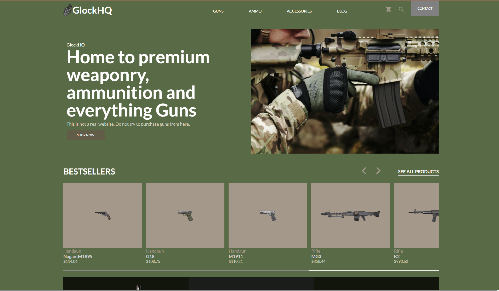
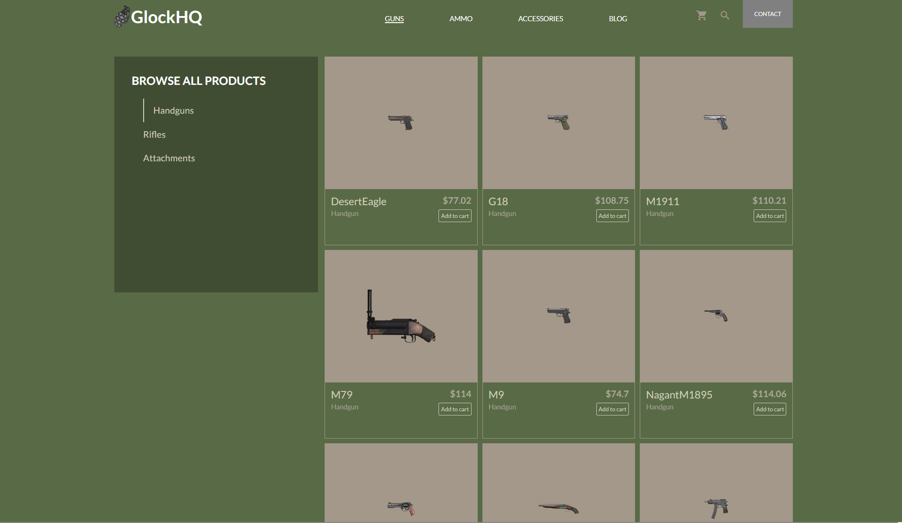
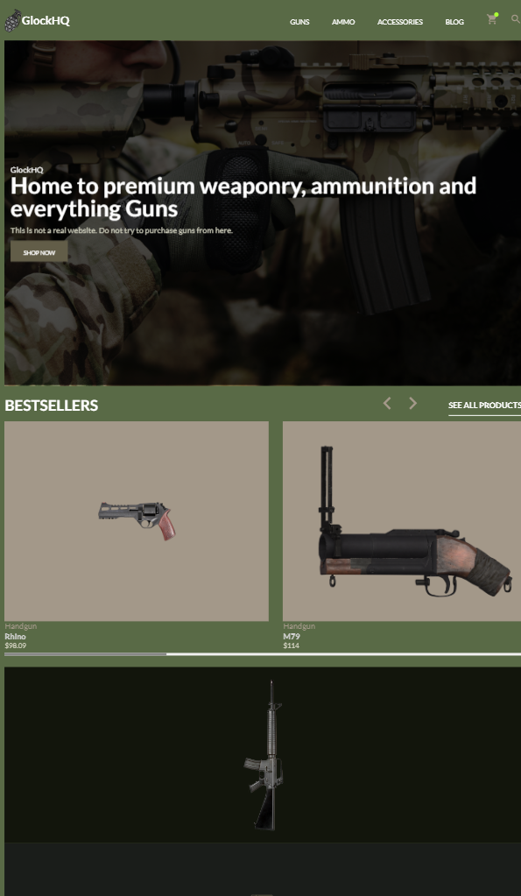
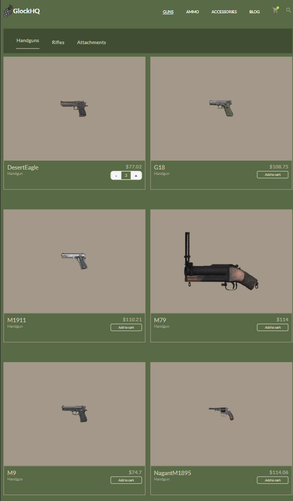

# GlockHQ
GlockHQ is a dummy weaponry and gunship marketplace. It was designed as part of [The Odin Project](https://www.theodinproject.com) React exercises to demonstrate master of core react concepts such as **routers**, **useState**, **useEffect** and **testing**. Check out the live demo [here]()

## Screenshots
Web version




Mobile Version

 

## Setting up dev
1. Clone the repository
   ```bash
   git clone <url>
   ```
2. Enter the directory using the terminal
   ```bash
   cd glockHQ
   ```
3. Install the necessary dependencies
   ```bash
   npm install
   ```
4. Run the dev server
   ```bash
   npm run dev
   ```
5. Access the project on [localhost:5173](http://localhost:5173)

## Built with
1. React
2. Vite